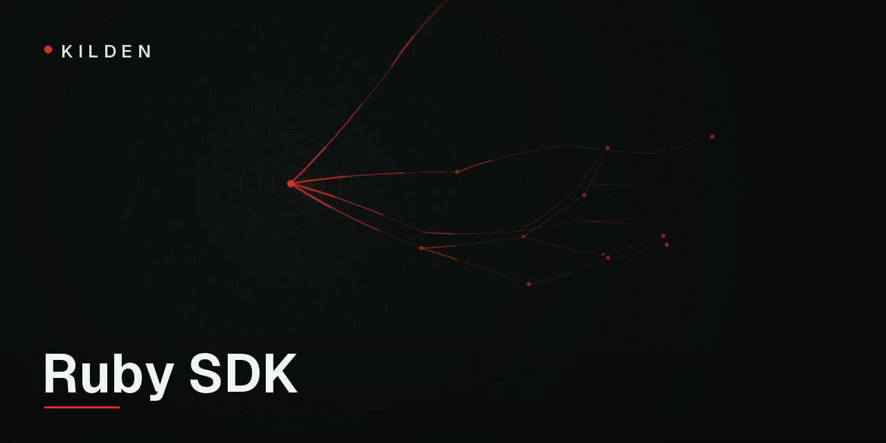

<p align="center">
  
</p>

# kilden

[](https://rubygems.org/gems/kilden)
[](https://github.com/kildenhq/kilden-sdk-ruby/actions/workflows/ci.yml)
[](LICENSE)

[Kilden](https://kilden.io) is a customer data platform — product analytics,
campaigns and session replay on one event pipeline. This is the server-side
Ruby SDK: events your backend can vouch for, identity-token signing, and
feature flags. Zero runtime dependencies, fork-safe under puma and unicorn.

```sh
gem install kilden --pre
```

```ruby
require "kilden"

kilden = Kilden::Client.new(ENV["KILDEN_SECRET_KEY"])
kilden.track("user_42", "order_completed", { "revenue" => 99.9, "currency" => "CLP" })
kilden.close # drain before the process exits
```

Use your project's **secret key** (`sk_…`), never the public one. Events sent
with the secret key land as `source=server`, `verified=true` — facts the
campaign engine can act on. The constructor rejects public keys outright, and
the secret key must never reach a browser.

## Identity verification

Anyone can open a devtools console and send events as `ceo@yourcompany.com`
with your public key. Kilden's fix is a short-lived JWT your backend signs;
the platform then marks those browser events verified. Signing it is the part
of the trust model only your backend can do, and it is three lines:

```ruby
signer = Kilden::IdentitySigner.new(ENV["KILDEN_IDENTITY_SECRET"], kid: "k1")

# In the controller that renders your page or serves your token endpoint:
token = signer.sign(current_user.id.to_s, traits: { "plan" => current_user.plan })
```

Hand `token` to the web SDK (`kilden.identify(id, traits, { token })` or its
refresh endpoint). Signed traits override unsigned ones during enrichment.

**Only sign a `sub` your backend authenticated.** Signing request input —
`signer.sign(params[:user_id])` — lets anyone impersonate anyone, with a
"verified" stamp on top. TTL defaults to 1 hour and is capped at 7 days.

A Rails token endpoint, for the web SDK to refresh against:

```ruby
# config/routes.rb
post "/kilden/identity", to: "kilden_identity#create"

# app/controllers/kilden_identity_controller.rb
class KildenIdentityController < ApplicationController
  before_action :authenticate_user!

  def create
    signer = Kilden::IdentitySigner.new(ENV["KILDEN_IDENTITY_SECRET"], kid: "k1")
    render json: {
      distinct_id: current_user.id.to_s,
      token: signer.sign(current_user.id.to_s),
      traits: {}
    }
  end
end
```

## Feature flags

Flags are evaluated remotely against `{host}/decide` and cached for 30
seconds per `distinct_id`. Always pass a `default:` — it is what you get when
Kilden cannot answer in time:

```ruby
if kilden.enabled?("new_checkout", "user_42",
                   person_properties: { "plan" => "pro" }, default: false)
  render_new_checkout
end

kilden.feature_flag("experiment_button", "user_42", default: false)
# => false | true | "variant_b"
```

`person_properties` overrides the stored person traits for that evaluation
only (and bypasses the cache). The signature is already shaped for local
evaluation, which will arrive without an API change.

## Batching and shutdown

Events queue in memory (bounded, default 10 000) and a background thread
flushes every 10 seconds or every 20 events, whichever comes first. The
queue never blocks your request thread; when it is full, new events are
dropped and counted in `kilden.dropped_count`.

**Call `close` when your process exits.** It drains the queue with a
10-second deadline and stops the worker. An `at_exit` hook covers the
forgetful, but a hard kill (SIGKILL, OOM) loses whatever was still queued —
that is the price of never blocking your app. `flush` forces a synchronous
drain without shutting down.

Retries: 429/5xx/network errors retry up to 3 times with exponential backoff
and jitter, honoring `Retry-After`. Other 4xx responses are dropped and
logged — retrying a 401 is spam.

### Preforking servers (puma, unicorn) and Sidekiq

Nothing to configure. The SDK detects the PID change after a fork, discards
the queue inherited from the master (the master still owns those events) and
starts a fresh worker thread in the child. This is tested in CI against a
real preforked puma. Sidekiq processes are plain long-lived processes: build
one client and reuse it.

## Configuration

```ruby
Kilden::Client.new(
  ENV["KILDEN_SECRET_KEY"],
  host: "https://ingest.kilden.io", # self-hosted: your ingest URL
  flush_at: 20,                     # queue length that triggers a flush
  flush_interval: 10,               # seconds between periodic flushes
  max_queue_size: 10_000,           # hard cap; new events drop beyond it
  timeout: 3,                       # seconds per HTTP request
  debug: false,                     # verbose logging, $-prefix warnings
  enabled: true                     # false = full no-op for tests/CI
)
```

## Spec

This SDK implements the
[Kilden server SDK spec](https://github.com/kildenhq/kilden-sdk-spec)
(v0.1) and runs its frozen test vectors — including byte-exact identity
tokens and the flag rollout hashing — against the spec's mock capture server
in CI. Behavior changes land in the spec first.

## Community

- [Docs](https://kilden.io/docs)
- [Discussions](https://github.com/kildenhq/kilden-sdk-ruby/discussions)
  for questions — answers stay searchable.

## License

[MIT](LICENSE)
